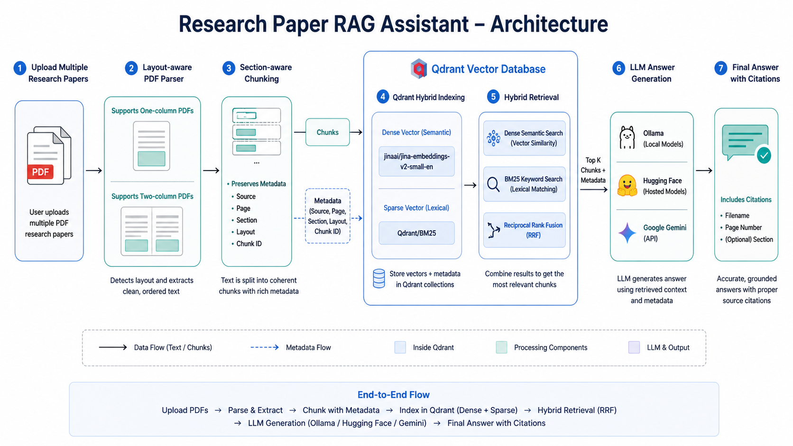
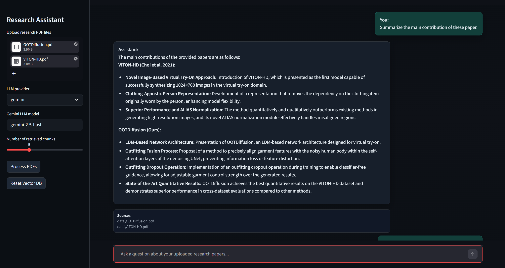
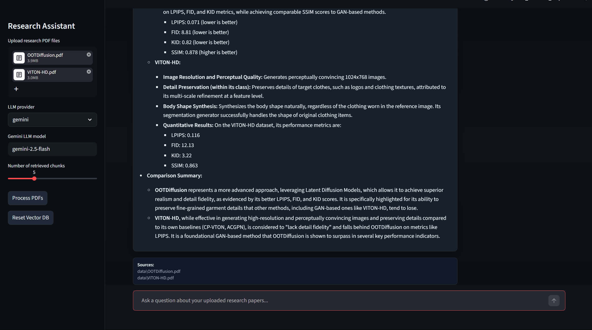
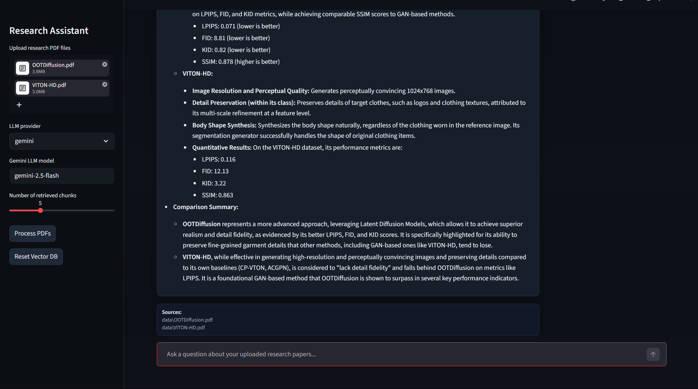

# Research Paper RAG Assistant

<p align="center">
  
</p>

<p align="center">
  
  
  
  
  
  
  
  
</p>

## Overview

Research Paper RAG Assistant is an AI chatbot for asking questions over multiple research paper PDFs. Users can upload one or more papers, process them into searchable chunks, and ask natural language questions through a Streamlit interface.

The system uses Retrieval-Augmented Generation (RAG) to retrieve relevant context before generating an answer. It supports both one-column and two-column PDF layouts, preserves source metadata, and uses Qdrant hybrid search to combine dense semantic retrieval with sparse BM25 keyword retrieval.

## Features

- Multi-PDF upload
- Layout-aware PDF parsing for one-column and two-column documents
- Section-aware text chunking with metadata preservation
- Qdrant hybrid search using dense vectors and BM25 sparse vectors
- Reciprocal Rank Fusion (RRF) for combining semantic and keyword results
- Fixed FastEmbed retrieval models for consistent indexing
- LLM support through Ollama, Hugging Face, and Google Gemini
- Source citations with filename and page number
- Streamlit web interface

## Architecture

The application follows a standard RAG pipeline:

```text
PDF Upload
   |
Layout-Aware PDF Extraction
   |
Section-Aware Chunking
   |
Qdrant Dense + BM25 Indexing
   |
Hybrid Retrieval with RRF
   |
LLM Answer Generation
   |
Answer with Source Citations
```

## Tech Stack

- Python
- Streamlit
- LangChain
- Qdrant
- FastEmbed
- Docker
- Ollama
- Hugging Face
- Google Gemini

## Project Structure

```text
.
|-- app.py
|-- docker-compose.yaml
|-- README.md
|-- requirements.txt
|-- html_template.py
|-- assets/
|-- data/
|-- qdrant_data/
|-- notebooks/
`-- src/
    |-- chunk_splitter.py
    |-- embeddings.py
    |-- llm.py
    |-- pdf_loader.py
    |-- rag.py
    `-- vector_db.py
```

## Installation

Clone the repository:

```bash
git clone https://github.com/Nhaaa4/Research-Paper-RAG-Assistant.git
cd Research-Paper-RAG-Assistant
```

Create and activate a virtual environment:

```bash
python -m venv .venv
```

```bash
# On Windows:
.venv\Scripts\activate
# On macOS or Linux:
source .venv/bin/activate
```

Install dependencies:

```bash
pip install -r requirements.txt
```

Create a `.env` file for Hugging Face and Gemini support:

```env
HUGGINGFACEHUB_API_TOKEN=your_huggingface_api_token_here
GOOGLE_API_KEY=your_google_api_key_here
```

## Run Qdrant

Start Qdrant with Docker Compose:

```bash
docker compose up -d
```

Check that Qdrant is running:

```bash
docker compose ps
```

Qdrant will be available at:

```text
http://localhost:6333/dashboard
```

Qdrant data is persisted in:

```text
./qdrant_data
```

Stop Qdrant with:

```bash
docker compose down
```

## Run the Application

Start the Streamlit app:

```bash
streamlit run app.py
```

Open the local URL shown in the terminal, usually:

```text
http://localhost:8501
```

## Configuration

The embedding models are fixed for hybrid retrieval and are generated by Qdrant FastEmbed:

```text
Dense model: jinaai/jina-embeddings-v2-small-en
Sparse model: Qdrant/bm25
Fusion: Reciprocal Rank Fusion (RRF)
```

LLM options:

```text
huggingface
ollama
gemini
```

Common configuration values:

```python
chunk_size = 1000
chunk_overlap = 200
top_k = 5
temperature = 0.1
```

These values can be adjusted in the relevant source files or through the Streamlit UI where available.

## Usage

1. Start Qdrant with `docker compose up -d`.
2. Start the Streamlit application.
3. Upload one or more research paper PDFs.
4. Select the LLM provider.
5. Click `Process PDFs`.
6. Ask questions about the uploaded papers.
7. Review the answer and cited sources.

## Example Questions

```text
Summarize the main contribution of this paper.
```

```text
What method does the paper propose?
```

```text
Which datasets are used in the experiments?
```

```text
How does this method compare with previous approaches?
```

```text
What are the main limitations mentioned by the authors?
```

## Limitations

- Answer quality depends on PDF text extraction quality.
- The system only answers from uploaded documents and does not use external knowledge.
- Large PDFs or many uploaded files can increase processing time.
- Scanned PDFs may require OCR before they can be processed accurately.
- Complex tables, equations, and figures may not be fully captured as text.

## Future Improvements

- Add a reranker for improved retrieval precision.
- Highlight cited source passages in the UI.
- Add evaluation metrics for retrieval and answer quality.
- Support multilingual research papers.
- Add OCR support for scanned PDFs.
- Add document-level filtering and advanced metadata search.

## Demo

<p align="center">
  
  
  
</p>

## License

MIT License
